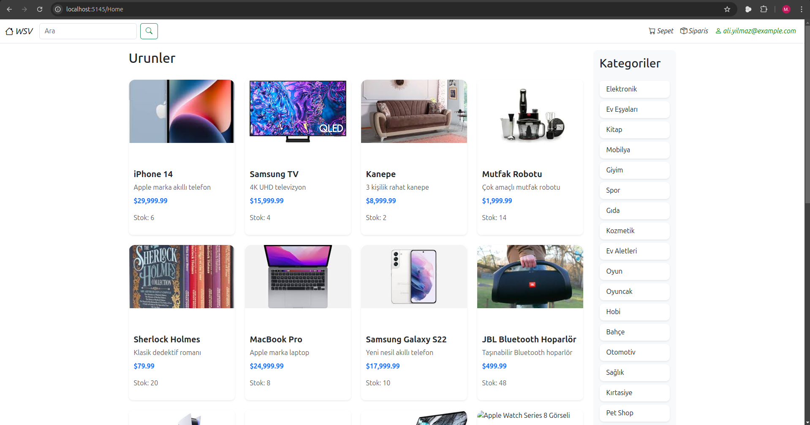
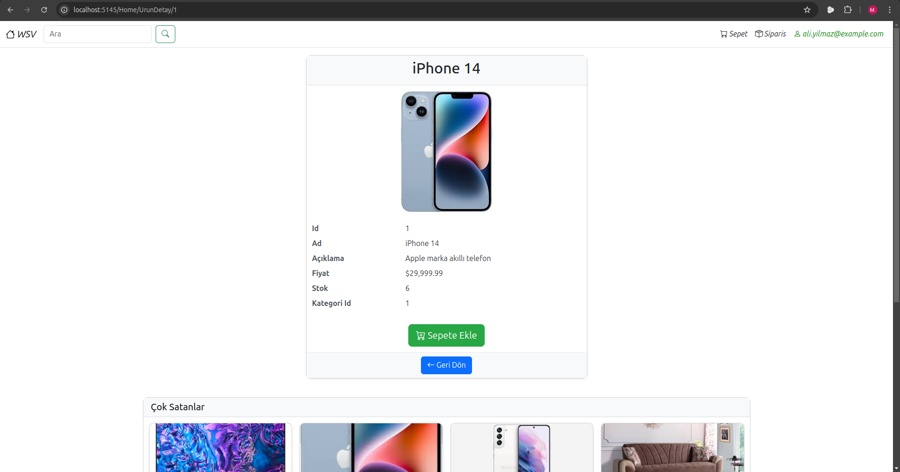
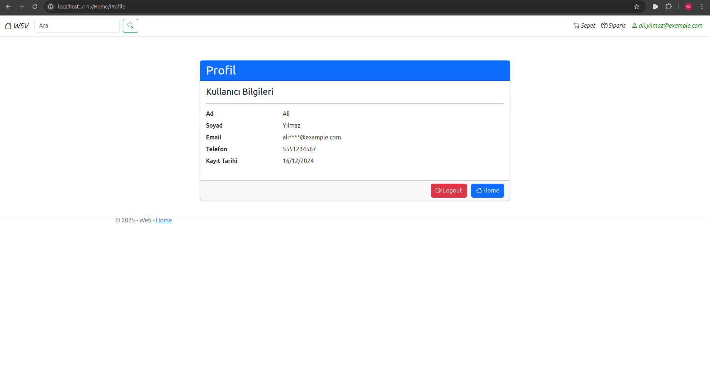
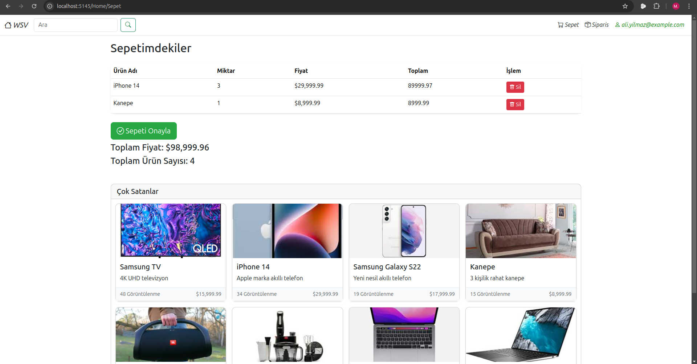
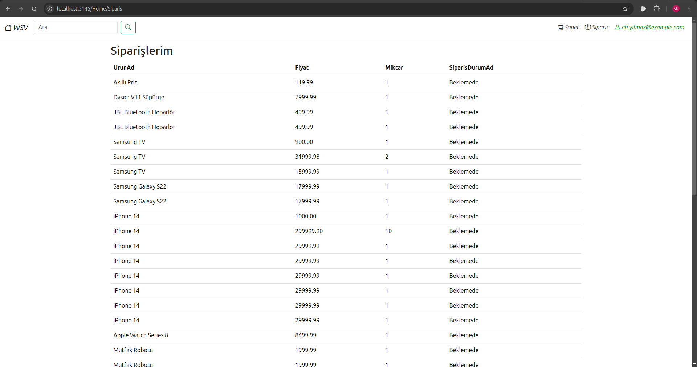

# E-Ticaret Uygulaması

Bu proje, **E-Ticaret Uygulaması** olarak geliştirilmiştir ve aşağıdaki ileri web proje isterlerini karşılamaktadır.

## Proje Özellikleri

### Layout

- **Özel bir Layout tasarımı** kullanılmıştır.
- Bu Layout'u kullanan ve kullanmayan sayfalar mevcuttur.

### View ve Responsive Tasarım

- Projede **5 farklı View** bulunmaktadır.
- Önyüz tasarımı **responsive** olup mobil, tablet ve masaüstü cihazlara uyumludur.

### PartialView ve ViewComponent

- **PartialView:** Sayfaların dinamik olarak değişmesini sağlayan bir PartialView eklenmiştir.
- **ViewComponent:** Sayfaların içeriğini dinamik hale getiren işlevsel bir ViewComponent mevcuttur.

### Entity Framework ve CRUD İşlemleri

- **Entity Framework** kullanılarak veritabanı işlemleri gerçekleştirilmiştir.
  - CRUD (Create, Read, Update, Delete) işlemleri tam olarak uygulanmıştır.
  - İlişkisel veritabanı yapısı kullanılmış ve ilişkili tablolarda değişiklikler yapılırken diğer tablolara yansıyan işlemler uygulanmıştır (örneğin, bir tablodan silme işlemi ile ilişkili tablolarda güncelleme yapılması).

### Veri Aktarımı

- Bir View üzerinden girilen veri, başka bir View üzerinden **ViewBag, ViewData veya TempData** kullanılarak erişilebilir hale getirilmiştir.

### Controller ve Action Yapısı

- Uygulamada **3 farklı Controller** ve her biri için **çok sayıda farklı Action** bulunmaktadır. Bu controller'lar uygulamanın e-ticaret fonksiyonlarına uygun şekilde düzenlenmiştir.

### Kullanıcı Yönetimi

- Kullanıcılar için:
  - Kayıt
  - Giriş/Çıkış
  - Rol tabanlı yetkilendirme işlemleri uygulanmıştır.
- Örnek: Sadece kayıtlı kullanıcıların erişebileceği sayfalar tanımlanmıştır.

## Veritabanı Tasarımı

- **RDBMS:** PostgreSQL kullanılmıştır.
- **Varlıklar:** 6 varlık içeren bir veritabanı tasarımı yapılmıştır.
- **Normalizasyon:** Veritabanı normalizasyon kurallarına uygun olarak tasarlanmıştır.
- **Veri Bütünlüğü:**
  - Uygun anahtar (primary/foreign key) ve constraint stratejileri uygulanmıştır.
  - En az 5 farklı constraint (örneğin, UNIQUE, NOT NULL, CHECK) kullanılmıştır.

### Performans ve Ek Özellikler

- **Sorgu Performansı:** Performansı artırmak için optimize edilmiş stratejiler kullanılmıştır (örneğin, indeksleme).
- **Stored Procedure:** 2 adet stored procedure tanımlanmıştır.
- **View:** 5 adet View kullanılmıştır.
- **Kullanıcı Tanımlı Fonksiyon:** 2 adet kullanıcı tanımlı fonksiyon geliştirilmiştir.
- **Yetkilendirme ve Maskeleme:** Kullanıcı yetkilendirme ve veri maskeleme işlemleri uygulanmıştır.

## Kurulum

### Gereksinimler

- **PostgreSQL**
- **.NET Core MVC**
- **Entity Framework**
- **HTML/CSS/JavaScript**
- **Bootstrap** (Responsive tasarım için kullanılmıştır.)

### Kurulum Adımları

1. **Projeyi klonlayın:**
   ```bash
   git clone https://github.com/oneoblomov/WSV
   ```
2. **Veritabanını oluşturun:**
   - PostgreSQL'de `ecommerce_db` adlı bir veritabanı oluşturun.
   - `/Migrations` klasöründeki dosyaları kullanarak veritabanını migrate edin:
     ```bash
     dotnet ef database update
     ```
3. **Projeyi çalıştırın:**
   ```bash
   dotnet run
   ```
4. **Tarayıcıda açın:**
   - Uygulama varsayılan olarak `http://localhost:5000` adresinde çalışır.

## Kullanım

- **Kayıt ve Giriş:** Kullanıcılar uygulamaya kayıt olabilir ve giriş yapabilir.
- **Ürün Yönetimi:** Ürün ekleme, güncelleme ve silme işlemleri yapılabilir.
- **Rol Tabanlı Yetkilendirme:** Admin kullanıcılar ürün ve kategori yönetiminde ek yetkilere sahiptir.
- **Sipariş Yönetimi:** Sipariş oluşturma ve listeleme işlemleri.

## Ekran Görüntüleri

Projenin bazı ekran görüntüleri aşağıda paylaşılmıştır:

### Anasayfa



### Ürün Listesi



### Kullanıcı Girişi



### Sepetimdekiler Sayfası



### siparislerim Sayfası



## Lisans

Bu proje MIT lisansı ile lisanslanmıştır. Daha fazla bilgi için [LICENSE](LICENSE) dosyasını inceleyebilirsiniz.
